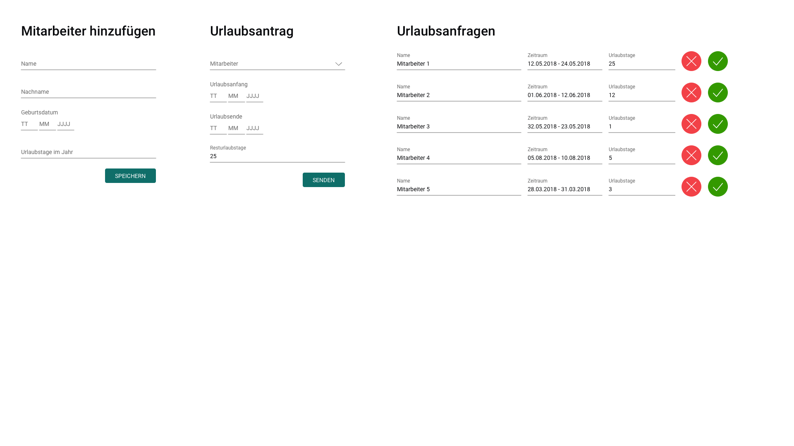

# Specification

Sabrina is a busy management assistant. She needs to do so many tasks in a day, and one of them,
is to handle the colleague’s vacations request.
Currently, she is doing it with an old-fashioned Office 1995 excel sheet.

We want to make Sabrina happy!

Let’s create a React app, that will use the following main libs:

* React
* Redux store
  * Bonus points for immutability

You may use any other package that helps you with the task, but please - no `$jQuery`.

---

## The app should have the following views:

### The "welcome colleague" view:

**A form where Sabrina can add a new colleague with the following details:**

* Full name
* Birth-date
* Number of allowed vacation days per year (vacation entitlement)
* Save button

### The "vacation request" view:

**A form where the colleague can request a vacation day:**

* A dropdown to select his name from a list
* Start and end date of requested vacation
* Once a name is selected from the dropdown - number of vacation days left should be displayed
* Save button

### The "approval" view:

**A form where the JBM (AKA the founders) can see new requests and approve them:**

* List of requests. Each raw should display:
  * The employee name
  * Start and end date of requested vacation
  * number of left vacation days (before the reduction of the requested days)
* Once approved, the number of days should be reduced from the vacation days left.
* If not approved - the row should disappear and the request is deleted from the store.

### Comments

* No need for a backend, please use the browser’s local storage.
* Pay attention to  separating presentational and container components: https://redux.js.org/docs/basics/UsageWithReact.html
* Try to use a boilerplate - It will make your life easier, [this is a recommended one](https://github.com/buckyroberts/React-Redux-Boilerplate)
* `$jQuery` is not allowed.
* Re-use of components is a plus!
* Mobile first! The forms should look nice on a modern mobile device.
